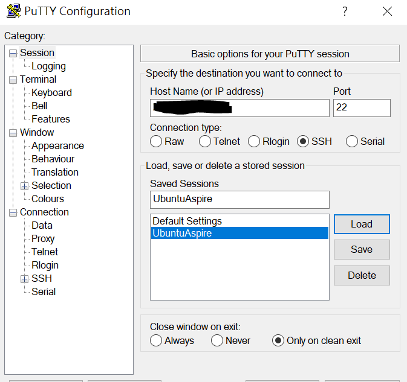
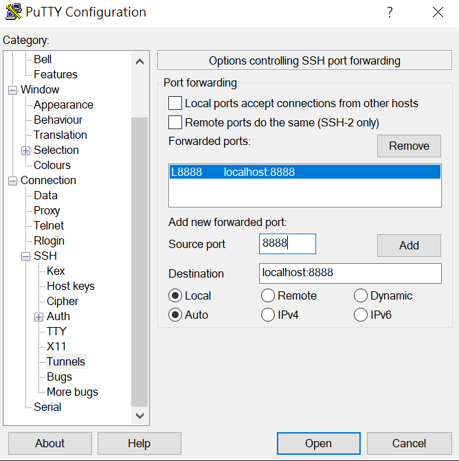

# Jupyter Notebook Management

# Index

1. [Jupyter Notebook Kernel Set-up](#Jupyter-Notebook-Kernel-Set-up)
2. [Jupyter Notebook Convert](#Jupyter-Notebook-Convert)
3. [Create Jupyter Notebook Content Index](#Create-Jupyter-Notebook-Content-Index)
4. [Remote Jupyter Notebook Server Setup](#Remote-Jupyter-Notebook-Server-Setup)

<br>

# Jupyter Notebook Kernel Set-up

* **Reference:** https://janakiev.com/blog/jupyter-virtual-envs/

* Install package to manage jupyter kernels.
  
  ```shell
  # Install package to manage jupyter kernels.
  pip install --user ipykernel
  # Add your conda VM into jupyter kernel
  conda activate XXXX # (your VM name)
  python -m ipykernel install --user --name=XXXX
  # Check jupyter kernel list
  jupyter kernelspec list
  # Delete jupyter kernel
  jupyter kernelspec uninstall XXXX
  ```

<br>

# Jupyter Notebook Convert

```shell
jupyter nbconvert --to html 190930_Homework_M946108004.ipynb
wkhtmltopdf 190930_Homework_M946108004.html 190930_Homework_M946108004.pdf
```

<br>

# Create Jupyter Notebook Content Index

```shell
conda install -c conda-forge jupyter_contrib_nbextensions
```

<br>

# Remote Jupyter Notebook Server Setup

**Reference:** https://www.digitalocean.com/community/tutorials/how-to-set-up-jupyter-notebook-with-python-3-on-ubuntu-18-04

Shown as below.





